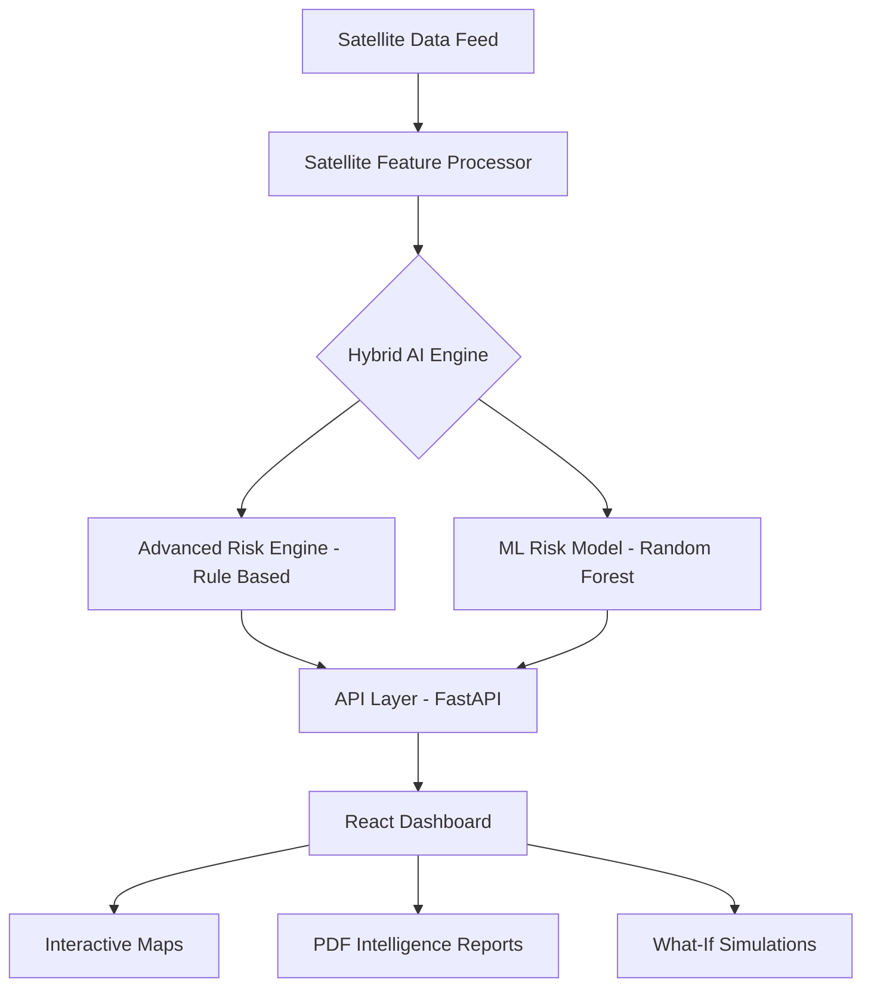

# 🌿 Bio-Risk Intelligence: AI-Driven Biodiversity Prediction

[](https://fastapi.tiangolo.com/)
[](https://reactjs.org/)
[](https://leafletjs.com/)
[](https://scikit-learn.org/)

**Bio-Risk Intelligence** is a state-of-the-art geospatial platform designed to monitor, analyze, and predict ecological risks. By leveraging multispectral satellite data and a hybrid AI reasoning engine, it provides actionable insights for conservation planning and biodiversity protection.

---

## 🚀 Key Features

- **🛰️ Satellite-Derived Intelligence**: Processes real-time (simulated) multispectral data including NDVI (Vegetation Health), LST (Land Surface Temperature), and Land Use patterns.
- **🧠 Dual-AI Reasoning Engine**: 
  - **Rule-Based Ecological Logic**: Deterministic reasoning based on established environmental thresholds.
  - **Machine Learning (ML)**: Random Forest Classifier for predictive risk confirmation and trend analysis.
- **🗺️ Interactive Geospatial Dashboard**: High-resolution mapping with Leaflet, featuring grid-based risk overlays and site-specific telemetry.
- **� What-If Scenario Simulations**: Project future risks by simulating urban expansion and climate-driven temperature increases.
- **📄 Professional Eco-Intelligence Reports**: Automated generation of detailed PDF reports for conservation stakeholders.
- **🇮🇳 Localized Mitigation Strategies**: Biome-specific action plans (e.g., Wetland restoration in Chennai vs. Wildlife corridor integrity in Jim Corbett).

---

## 🛠️ Tech Stack

### Frontend
- **Framework**: React 19 (Vite)
- **Mapping**: Leaflet / React-Leaflet
- **Data Viz**: Recharts (Telemetry & Forecasts)
- **UI/UX**: Framer Motion (Animations), Lucide React (Icons)
- **State Management**: React Hooks & Context API

### Backend
- **Framework**: FastAPI (Python 3.9+)
- **Validation**: Pydantic
- **Data Science**: Scikit-Learn, NumPy, Pandas
- **PDF Core**: FPDF2
- **Server**: Uvicorn

---

## 🏗️ System Architecture



---

## � Getting Started

### Prerequisites
- Python 3.9+ 
- Node.js 18+

### 🏠 1. Setup Backend
```bash
cd backend
python -m venv venv
.\venv\Scripts\activate   # Windows
# source venv/bin/activate # Mac/Linux
pip install -r requirements.txt
python main.py
```
*The API will be live at `http://127.0.0.1:8000`*

### 💻 2. Setup Frontend
```bash
cd frontend
npm install
npm run dev
```
*Access the dashboard at `http://localhost:5173`*

---

## 🧪 Environmental Indicators
The system monitors four primary indicators to determine risk:
1. **NDVI (Normalized Difference Vegetation Index)**: Measures canopy health and biomass density.
2. **Land Use Analysis**: Detects shifts between Forest, Urban, Agriculture, and Water bodies.
3. **Thermal Anomaly**: Tracks departures from regional temperature baselines (Heat Island Effect).
4. **Hydrological Stability**: Monitors moisture levels and wetland persistence.

---

## 📺 Demo Video
Watch the platform in action: [Bio-Risk Intelligence Demo](https://youtu.be/HTevqclV9ak)

## 📄 License
This project is developed for educational and research purposes in biodiversity conservation.

---

